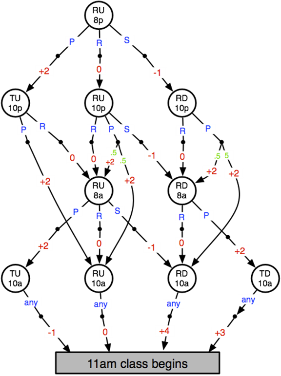

# PA3: Solving MDPs

## Objective
The goal of this project is to experiment with algorithms for solving Markov Decision Processes (MDPs) on a simple domain representing the life of a student balancing fun and academics.

The domain is adapted from an MDP example designed by Rich Sutton. It includes states, actions, rewards, and transition probabilities.

### States
- **R:** Rested  
- **T:** Tired  
- **D:** Homework Done  
- **U:** Homework Undone  
- **8p:** 8 PM  

### Actions
- **P:** Party  
- **R:** Rest  
- **S:** Study  
- **any:** All actions have the same effect (not all actions are possible in every state).

### Notes
- Red numbers on the diagram indicate **rewards**.
- Green numbers indicate **transition probabilities** (defaults to 1.0 if not labeled).
- The gray rectangle denotes a **terminal state**.



---

## Parts of the Project

### Part I: Monte Carlo Simulation
1. Model the MDP, assuming the agent follows a **random equiprobable policy**.
2. Simulate **50 episodes** and output:
   - Sequence of states, actions, and rewards for each episode.
   - The sum of rewards for each episode.
3. Perform **first-visit Monte Carlo updates** (α = 0.1) to update state values after each episode.
4. At the end, output:
   - Final state values.
   - Average reward per episode.

---

### Part II: Value Iteration
1. Implement the **value iteration algorithm** to find the optimal policy:
   - Initialize state values to 0.
   - Use a discount rate (λ) of **0.99**.
   - Update until the maximum value change for any state is < **0.001**.
2. For each state update, output:
   - Previous and new state values.
   - Estimated action values.
   - Selected action.
3. Final outputs:
   - Total iterations.
   - Final state values.
   - Optimal policy.

---

### Part III: Q-Learning
1. Implement the **Q-learning algorithm** to find the optimal policy:
   - Use an initial learning rate (α) of **0.2**.
   - Discount rate (λ): **0.99**.
   - Decrease α after each episode: `α = α * 0.995`.
2. Run episodes repeatedly until the maximum Q-value change is < **0.001**.
3. For each Q-value update, output:
   - Previous and new Q-values.
   - Immediate reward.
   - Q-value for the next state.
4. Final outputs:
   - Total episodes.
   - Final Q-values.
   - Optimal policy.

---

## Getting Started
Clone this repository:
```bash
git clone https://github.com/WokyDoky/markov-decision-process.git
